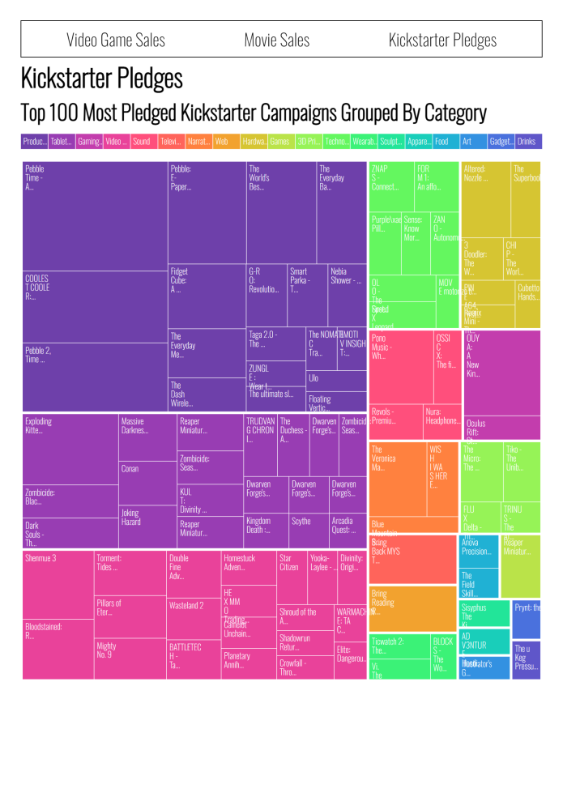
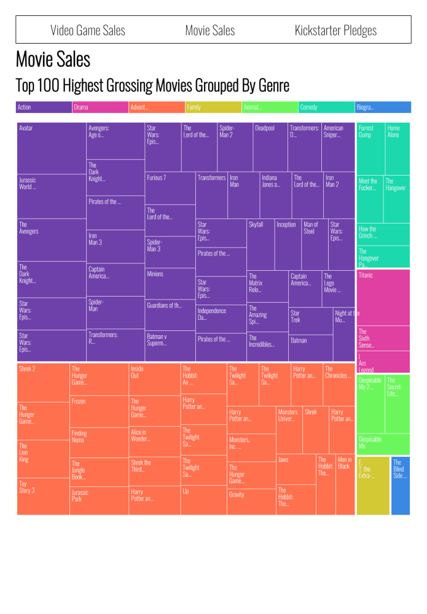

# [freeCodeCamp Data Visualization certification](https://www.freecodecamp.org/learn/data-visualization/)

## [Visualize Data with a Treemap-Diagram project](https://www.freecodecamp.org/learn/data-visualization/data-visualization-projects/visualize-data-with-a-treemap-diagram)

Working example: https://raff1010x.github.io/21.Data-Visualization-Projects--Visualize-Data-with-a-Treemap-Diagram/

My git repo: https://github.com/Raff1010X/01.Roadmap

